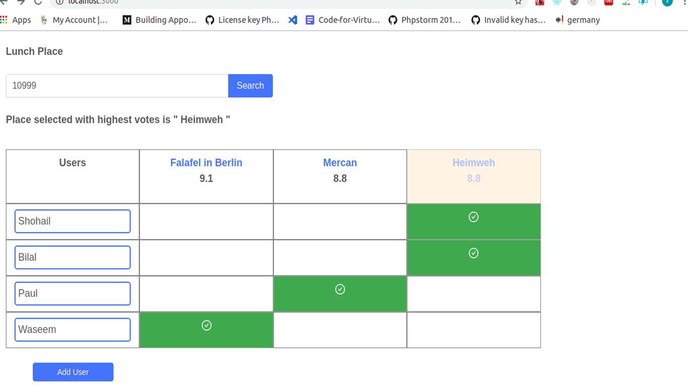

This Application uses the foursquare api to get recommended location and lets users to vote which one to go to.

This project was bootstrapped with [Create React App](https://github.com/facebook/create-react-app).

### Libraries used
antd - https://ant.design/

### End points used from foursquare
1.venue recommendations : https://api.foursquare.com/v2/venues/explore

2.for venue details: https://api.foursquare.com/v2/venues/VENUE_ID

### Cors
some browsers might find the api blocked with cors. 
In case of cors blockage download any cors extension from chrome extension enable it .

## Available Scripts
### `npm install`

### `npm start`

Runs the app in the development mode. 
Open [http://localhost:3000](http://localhost:3000) to view it in the browser.

The page will reload if you make edits. 
You will also see any lint errors in the console.
